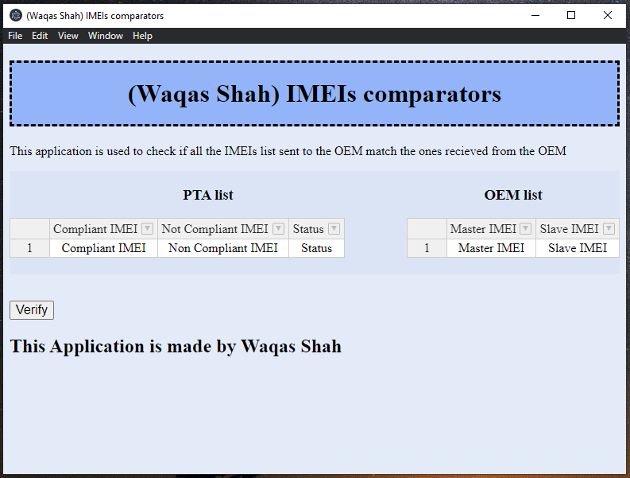

# IMEI comparator
### <u>Use case</u>
The application is  used to compare the IMEI data that the user has compared to the IMEI data from OEM (Original Equipment Manufacturer).

### <u>Requirements</u>
This application requires the following to be installed
>* Electron
>* Handsontable  

### <u>Screenshot</u>

### <u>Description</u>
This application uses Electron, javaScript and HTML to create an application. To run the application go to the directory containing this application and type the following command in the terminal.
> <b>./main.js </b>